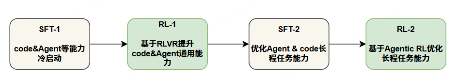
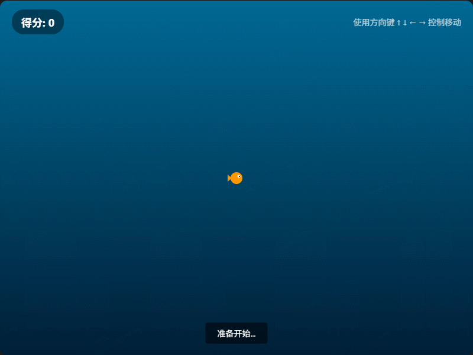
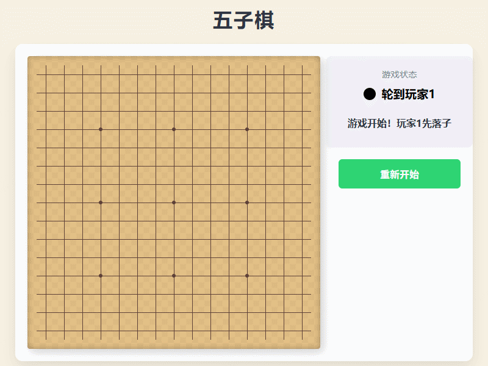

<div align="center">
<h1>
  TeleChat3-Coder
</h1>
</div>

<p align="center">
   🦉 <a href="https://github.com/Tele-AI/TeleChat3-Coder" target="_blank">github</a> • 🤗 <a href="https://huggingface.co/Tele-AI" target="_blank">Hugging Face</a> • 🤖 <a href="https://modelscope.cn/organization/TeleAI" target="_blank">ModelScope</a> • 💬 <a href="https://github.com/Tele-AI/Telechat/blob/master/images/wechat.jpg" target="_blank">WeChat</a>
</p>

# 目录

- [模型介绍](#模型介绍)
- [能力评估](#能力评估)
- [推理](#gpu-推理)
- [国产化适配](#国产化适配)
- [声明、协议、引用](#声明协议引用)

# 最新动态
- 2026.01.30 开源 **TeleChat3-Coder-36B-Thinking**

# 模型介绍

### 星辰语义代码大模型-TeleChat3-Coder

- 星辰语义代码大模型 **TeleChat3-Coder** 是由中国电信人工智能研究院研发训练的大语言模型，该模型**完全基于国产算力**训练。

### 技术创新
#### 预训练

**TeleChat3-Coder-36B-Thinking** 在 TeleBase3 基础上持续进行三阶段代码预训练：
- 第一阶段：在 TeleBase3 的基础上，将通用代码数据占比提升至 70%，并基于 8K 上下文长度进行持续训练，以增强模型的代码通识能力；
- 第二阶段：优化代码数据组成，尤其增加了高质量仓库级别代码长文数据、SWE 级别长程代码任务数据等，以相同数据配比，基于 32K 上下文长度开展持续训练，增加模型长文任务能力；
- 第三阶段：进一步提升长程代码任务与智能体任务数据占比，并基于 128K 上下文长度进行持续训练，持续增强模型在代码与智能体长程任务场景下的综合能力。


#### 后训练
- 为进一步提升代码能力与 Agent 任务表现，我们在推理阶段引入 Interleaved Thinking 机制，并通过大量实验验证其在多轮工具交互场景下具备较明显优势；
- 为提升 Agentic Coding 能力，我们搭建了上万个执行环境，用于合成任务轨迹数据，并支撑 Agentic RL 训练；
- 为提升 Web Vibe Coding 效果，我们基于 GUI-Agent 构建了一套可自动操作 Web 界面并进行生成结果评估的系统，大幅提升了数据质量。

**TeleChat3-Coder-36B-Thinking** 后训练采用迭代式提升方案：
- 第一阶段：模型冷启动微调，主要提升模型通用代码、Agent、推理、指令理解等能力，为了取得更好的冷启动效果，针对微调数据难度和多样性做了大量筛选工作；
- 第二阶段：强化学习，采用了基于规则校验奖励和 RM 打分模型融合的方式，对模型综合能力进行进一步强化；
- 第三阶段：在上一阶段模型基础上，开展长程 Agent 与 Coding 任务的专项微调优化；
- 第四阶段：主要通过 Agentic RL 训练策略优化模型长程任务能力。



### 模型结构

**TeleChat3-Coder-36B-Thinking** 的模型结构配置和 **TeleChat3-36B-Thinking** 一致：

|      | Layers | Hidden Size | FFN Intermediate | Attention |
|------|-----------|------|------|-----|
| TeleChat3-Coder-36B-Thinking  | 64        | 6144        | 24576   | GQA | 


# 能力评估
**TeleChat3-Coder-36B-Thinking** 在代码综合能力上，不论是 Agentic Coding 还是通用代码类任务均有很好表现，同尺寸模型效果达到最优水平；
**TeleChat3-Coder-36B-Thinking** 在 Agent 能力上同样表现很好，在 BFCL 和 Tau2-Bench 榜单上达到同级别参数较好水平。

| 评测集                        | 任务类型  | Kimi-Dev-72B | Qwen3-32B-Thinking | Qwen3-30B-A3B-2507 | Qwen3-Coder-480B-A35B-Instruct | TeleChat3-Coder-36B-Thinking | 
|----------------------------|-------|---------------|--------------------|-----------|--------------|----------------------|
| IFEval                   | 指令    | -          | **85**               | 81.2     | 82.4        | **84.6**                 |
| SWE-bench Verified                   | 代码    | 60.4          | 28               | 51.6     | **69.6**        | **65**                 |
| Terminal Bench                   | 代码    | -          | 1.2               | 31.3     | **37.5**        | **34.8**                 |
| Livecodebench(24.08-25.05)                   | 代码    | 51.5          | 66.7               | 42.5     | 57.5        | **78.2**                 |
| ArtifactsBench                   | 代码    | -          | 64.3               | 73.8     | 78.7        | **82.8**                 |
| HumanEval-X                   | 代码    | 67.44          | 84.3               | 88.9     | **91.7**        | 88.9                 |
| MBPP-Plus                   | 代码    | -          | **83.9**               | 79.9     | 79.4        | **84.2**                 |
| CRUXEval                   | 代码    | -          | **95**               | 74.1     | 75.9        | 89.7                 |
| BFCL-V3                   | Agent    | -          | **70.3**          | 59.2               | 68.7     | **70.5**                 |
| Tau2-Bench                   | Agent    | -          | 41.7          | 31.2               | 47     | **70**                 |

### 代码场景 Cases
#### Case1: 大鱼吃小鱼
**Prompt**
```markdown
**游戏名称**: 大鱼吃小鱼

**基本功能**:
1. 游戏界面为水域风格的操作区域，包含核心元素：
   - 玩家小鱼（可操控角色，有基础大小）；
   - 其他鱼（不同大小的鱼类，随机分布在操作区域）；
   - 基础功能区：显示当前得分、“开始/重新开始”按钮；
   - 简单提示区：文字显示吃小鱼得分、被大鱼吃掉、游戏胜利/失败等反馈。

2. 核心交互规则：
   - 操控逻辑：方向键（上下左右）控制玩家小鱼在水域内自由移动，无法超出操作区域边界；
   - 吞噬规则：
     ① 吃小鱼：玩家小鱼接触到比自身小的鱼时，判定吞噬成功，被吞噬的鱼消失，玩家小鱼体型变大，得分增加，提示吞噬成功；
     ② 被大鱼吃：玩家小鱼接触到比自身大的鱼时，立即判定游戏失败，禁用所有操作，提示“被大鱼吃掉！游戏失败”；
   - 胜利判定：玩家小鱼吞噬足够多的小鱼，体型达到设定的最大尺寸时，判定游戏胜利，禁用所有操作，提示“成为最大的鱼！通关成功”；
   - 鱼类生成：游戏开始后，不同大小的鱼会随机出现在操作区域，数量和移动速度由代码合理控制。

3. 基础玩法：
   1. 游戏初始化后，点击“开始”按钮启动游戏，各类鱼开始随机移动；
   2. 玩家通过方向键操控小鱼移动，优先吞噬比自己小的鱼长大，避开比自己大的鱼；
   3. 游戏失败/胜利后，点击“重新开始”可重置小鱼体型、得分和所有鱼类位置，重新游玩。

请基于上述要求编写完整HTML代码
```
**代码生成效果**

<div align="center">
    
    <p>👉点击体验 <a href="./Demo/大鱼吃小鱼.html">大鱼吃小鱼</a></p>
</div>


#### Case2: 五子棋
**Prompt**
```markdown
**游戏名称**: 五子棋

**基本功能**:
1. 游戏界面为网格形式的对弈区域，包含核心元素：
   - 空白网格（供落子）；
   - 两种不同标识的棋子（区分两位玩家）；
   - 基础功能区：显示当前落子方、“重新开始”按钮；
   - 简单提示区：文字显示获胜方、平局（可选）等反馈。

2. 核心交互规则：
   - 落子逻辑：
     ① 玩家1、玩家2轮流点击空白网格格子落子，各自的棋子有明确区分标识；
     ② 已落子的格子无法重复点击，点击无响应；
   - 胜利判定：
     ① 任意一方的棋子在网格中连成横、竖、斜向的5子一线，立即判定该玩家获胜，禁用所有落子操作，提示区显示“X玩家获胜！”；
     ② 网格全部落满且无5子连线，判定平局，提示区显示“平局！”。

3. 基础玩法：
   1. 游戏初始化后，提示区显示“游戏开始！玩家1先落子”；
   2. 两位玩家交替点击空白格子落子，率先将5颗棋子连成一线的玩家获胜；
   3. 游戏获胜/平局后，点击“重新开始”可清空所有棋子，重置游戏状态，重新开始对弈。

请基于上述要求编写完整HTML代码
```
**代码生成效果**
<div align="center">
    
    <p>👉点击体验 <a href="./Demo/五子棋.html">五子棋</a></p>
</div>

# 推理

### Tranformers 推理

TeleChat3-Coder 模型支持使用 `transformers` 库进行推理，示例如下：

```python
import os
import torch
from transformers import AutoModelForCausalLM, AutoTokenizer, GenerationConfig
tokenizer = AutoTokenizer.from_pretrained('./TeleChat3-Coder-36B-Thinking', trust_remote_code=True)
model = AutoModelForCausalLM.from_pretrained('./TeleChat3-Coder-36B-Thinking', trust_remote_code=True, device_map="auto",torch_dtype=torch.bfloat16)
prompt = "生抽与老抽的区别？"
messages = [{"role": "user", "content": prompt}]
text = tokenizer.apply_chat_template(messages,
    tokenize=False,
    add_generation_prompt=True
)
model_inputs = tokenizer(text, return_tensors="pt").to(model.device)
generated_ids = model.generate(
    **model_inputs,
    top_p=0.95,
    temperature=0.6,
    repetition_penalty=1.0,
    max_new_tokens=16384
)
response = tokenizer.decode(generated_ids[0], skip_special_tokens=False,spaces_between_special_tokens=False)
answer = response.split("</think>")[-1].strip()

```

### VLLM 推理

为适配 Interleaved Thinking 推理范式，我们基于 TeleChat3 系列模型重新设计了 Chat Template 及 Tool Call 的拼接方式。因此，在对 TeleChat3-Coder 模型进行推理部署时，请首先参考 [TeleChat3-Coder vllm 补丁](TeleChat3-Coder_vllm_tool_parser/README.md) 进行 vllm 配置，vllm 版本推荐使用0.9.2。

然后，执行以下命令进行模型部署：

```shell
export CUDA_VISIBLE_DEVICES=0,1,2,3,4,5,6,7
python3 -m vllm.entrypoints.openai.api_server \
        --model TeleChat3-Coder-36B-Thinking  \
        --trust-remote-code \
        --tensor-parallel-size 8 \
        --dtype bfloat16 \
        --port 8000 \
        --gpu-memory-utilization 0.9 \
        --uvicorn-log-level "error" \
        --max-model-len 131072 \
        --enable-reasoning \
        --enable-auto-tool-choice \
        --tool-call-parser telechat3 \
        --reasoning-parser deepseek_r1 \
        --disable-custom-all-reduce \
        --chat-template-content-format string
```

然后，您可以与 TeleChat3-Coder 进行对话：
```python
from openai import OpenAI
openai_api_key = "EMPTY"
openai_api_base = "http://localhost:8000/v1"

client = OpenAI(api_key=openai_api_key, base_url=openai_api_base)
chat_response = client.chat.completions.create(
    model="TeleChat3-Coder-36B-Thinking",
    messages=[
        {"role": "user", "content": "生抽和酱油的区别是什么？"},
    ],
    temperature=0.6,
    top_p=0.95,
    max_tokens=16384,
    extra_body={
        "repetition_penalty": 1.0,
        "skip_special_tokens": False,
        "spaces_between_special_tokens": False,
    },
)
print("Chat response:", chat_response)
```
**注意：** `skip_special_tokens`和`spaces_between_special_tokens`参数必须设置为 False，否则将无法正常解析推理结果
### 推理参数选择
- 在推理**代码任务**时，建议使用`repetition_penalty=1.0, top_p=0.95`, `temperature`设为`0.8-1.0`之间的值进行推理。
- 在推理 **Agent 任务**时，建议使用`repetition_penalty=1.0, temperature=0.6, top_p=0.95`进行推理。


# 国产化适配

### 昇腾 Atlas 800T A2 训练服务器实现训练、推理适配

#### 核心组件：

- 昇思 MindSpore：该框架是华为开发的深度学习框架，旨在为AI应用提供高效、灵活的开发环境。它支持多种硬件平台，并具有自动微分、模型优化等功能，适合各种深度学习任务。

- MindSpore Transformers：该框架的目标是构建一个大模型训练、微调、评估、推理、部署的全流程开发套件，提供业内主流的 Transformer 类预训练模型和 SOTA 下游任务应用，涵盖丰富的并行特性。期望帮助用户轻松的实现大模型训练和创新研发。

**当前星辰语义代码大模型 TeleChat3-Coder 支持昇腾 Atlas 800T A2 训练服务器，可基于昇思 MindSpore 框架以及 MindSpore Transformers 框架进行模型训练和评测。如果您对 MindFormers 相关特性有疑问，也可以查看 [MindFormers官方代码和文档](https://gitee.com/mindspore/mindformers/tree/dev/)。**


# 致谢

在此，我们要向开源社区的伟大贡献致以最深切的谢意——正是站在这些巨人的肩膀上，我们才得以眺望更远的风景。

特别的向 DeepSeek 团队表达我们诚挚的感激。借鉴其模型架构的设计智慧，为我们模型的训练过程赋予了显著的稳定性与效率，使探索之路更为平稳而清晰。


# 声明、协议、引用

### 声明

我们在此声明，不要使用 TeleChat3-Coder 模型及其衍生模型进行任何危害国家社会安全或违法的活动。同时，我们也要求使用者不要将 TeleChat3-Coder 模型用于没有安全审查和备案的互联网服务。我们希望所有使用者遵守上述原则，确保科技发展在合法合规的环境下进行。

我们已经尽我们所能，来确保模型训练过程中使用的数据的合规性。然而，尽管我们已经做出了巨大的努力，但由于模型和数据的复杂性，仍有可能存在一些无法预见的问题。因此，如果由于使用 TeleChat3-Coder 开源模型而导致的任何问题，包括但不限于数据安全问题、公共舆论风险，或模型被误导、滥用、传播或不当利用所带来的任何风险和问题，我们将不承担任何责任。


### 引用

如需引用我们的工作，请使用如下 reference:

```
@misc{liu2025trainingreporttelechat3moe,
      title={Training Report of TeleChat3-MoE}, 
      author={Xinzhang Liu and Chao Wang and Zhihao Yang and Zhuo Jiang and Xuncheng Zhao and Haoran Wang and Lei Li and Dongdong He and Luobin Liu and Kaizhe Yuan and Han Gao and Zihan Wang and Yitong Yao and Sishi Xiong and Wenmin Deng and Haowei He and Kaidong Yu and Yu Zhao and Ruiyu Fang and Yuhao Jiang and Yingyan Li and Xiaohui Hu and Xi Yu and Jingqi Li and Yanwei Liu and Qingli Li and Xinyu Shi and Junhao Niu and Chengnuo Huang and Yao Xiao and Ruiwen Wang and Fengkai Li and Luwen Pu and Kaipeng Jia and Fubei Yao and Yuyao Huang and Xuewei He and Zhuoru Jiang and Ruiting Song and Rui Xue and Qiyi Xie and Jie Zhang and Zilu Huang and Zhaoxi Zhang and Zhilong Lu and Yanhan Zhang and Yin Zhang and Yanlei Xue and Zhu Yuan and Teng Su and Xin Jiang and Shuangyong Song and Yongxiang Li and Xuelong Li},
      year={2025},
      eprint={2512.24157},
      archivePrefix={arXiv},
      primaryClass={cs.CL},
      url={https://arxiv.org/abs/2512.24157}, 
}
@misc{wang2025technicalreporttelechat2telechat25,
      title={Technical Report of TeleChat2, TeleChat2.5 and T1}, 
      author={Zihan Wang and Xinzhang Liu and Yitong Yao and Chao Wang and Yu Zhao and Zhihao Yang and Wenmin Deng and Kaipeng Jia and Jiaxin Peng and Yuyao Huang and Sishi Xiong and Zhuo Jiang and Kaidong Yu and Xiaohui Hu and Fubei Yao and Ruiyu Fang and Zhuoru Jiang and Ruiting Song and Qiyi Xie and Rui Xue and Xuewei He and Yanlei Xue and Zhu Yuan and Zhaoxi Zhang and Zilu Huang and Shiquan Wang and Xin Wang and Hanming Wu and Mingyuan Wang and Xufeng Zhan and Yuhan Sun and Zhaohu Xing and Yuhao Jiang and Bingkai Yang and Shuangyong Song and Yongxiang Li and Zhongjiang He and Xuelong Li},
      year={2025},
      eprint={2507.18013},
      archivePrefix={arXiv},
      primaryClass={cs.CL},
      url={https://arxiv.org/abs/2507.18013}, 
}

```

